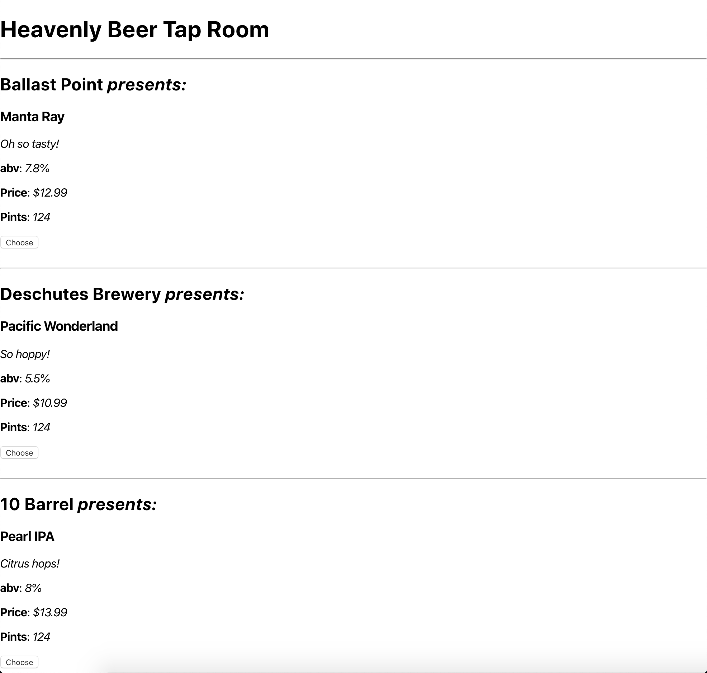

# Heavenly Beer Tap Room.

#### _2/21/2020_

#### _By Jonathan Carlos_

## **Description**

_This is an application that will allow a user to add a keg of their choice, it's brand name, description, abv, and price. A details page will allow a user to Tap, Fill, Update, or Delete the keg._

## Preview

  

 

## **Minimum Viable Product (MVP)**

The MVP of this project is to allow a user to add, view, edit, and delete a keg of their choice. It would also include the ability to tap the keg as well as refill it as desired.

Stretch goals include:

* Add feature that displays "Out of Stock" as the pint value once a keg is empty.
* Add feature that includes a message that displays "Almost Out" when a keg is at 10 pints or less.
* Add feautre that color-codes keg prices for easy readability.
* Nicely style the application.

## **Setup/Installation**

*Option One:*
1. Open up your terminal.
2. Navigate to the desired directory in which you want to clone this repository.
3. Use `git clone https://github.com/jamestlalocPDX/tap-room` to clone this repository.
4. Open the repository.
5. Install all dependencies using `$ npm install` in your terminal.
6. Use `$ npm run build` to start a package bundle.
7. Use `$ npm run start` in your terminal for a live development server.
8. Click a spot on the map.
9. Enter information on your experience.
10. Click "Enter!"

## Available Scripts

This project was bootstrapped with [Create React App](https://github.com/facebook/create-react-app).

In the project directory, you can run:

### `npm start`

Runs the app in the development mode. 
Open [http://localhost:3000](http://localhost:3000) to view it in the browser.

The page will reload if you make edits. 
You will also see any lint errors in the console.

### `npm test`

Launches the test runner in the interactive watch mode. 
See the section about [running tests](https://facebook.github.io/create-react-app/docs/running-tests) for more information.

### `npm run build`

Builds the app for production to the `build` folder. 
It correctly bundles React in production mode and optimizes the build for the best performance.

The build is minified and the filenames include the hashes. 
Your app is ready to be deployed!

See the section about [deployment](https://facebook.github.io/create-react-app/docs/deployment) for more information.

### `npm run eject`

**Note: this is a one-way operation. Once you `eject`, you can’t go back!**

If you aren’t satisfied with the build tool and configuration choices, you can `eject` at any time. This command will remove the single build dependency from your project.

Instead, it will copy all the configuration files and the transitive dependencies (webpack, Babel, ESLint, etc) right into your project so you have full control over them. All of the commands except `eject` will still work, but they will point to the copied scripts so you can tweak them. At this point you’re on your own.

You don’t have to ever use `eject`. The curated feature set is suitable for small and middle deployments, and you shouldn’t feel obligated to use this feature. However we understand that this tool wouldn’t be useful if you couldn’t customize it when you are ready for it.

## **Known Bugs**

No known bugs at this time.

## **Support and contact details**

If you have any questions, comments, or concerns, feel free to contact the content creator at examplemail@company.net 

## **Technologies used**
* Webpack

* JavaScript 

* Visual Studio Code

* GitBash

## **License**

Copyright (c) 2020 **_Heavenly Beer Tap Room_**

This software is licensed under the MIT license.